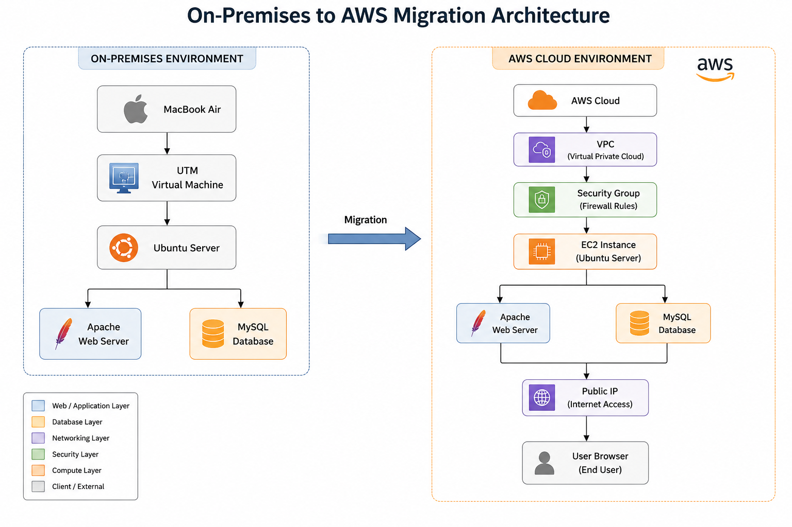
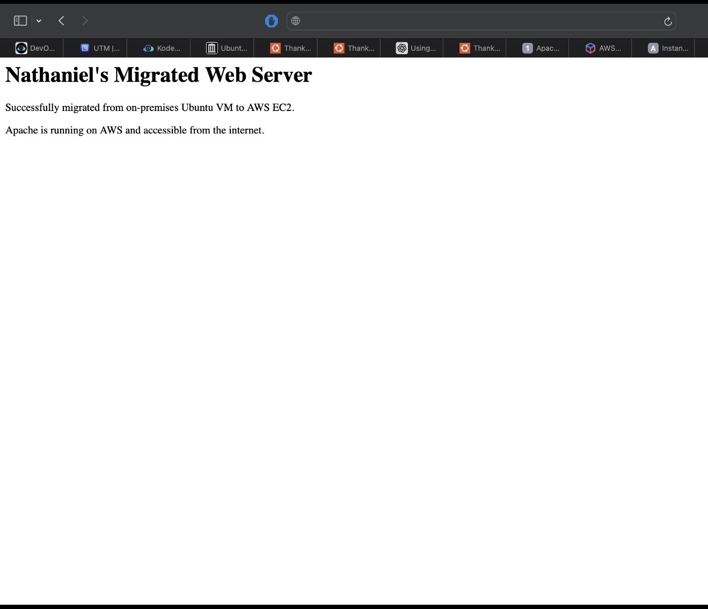
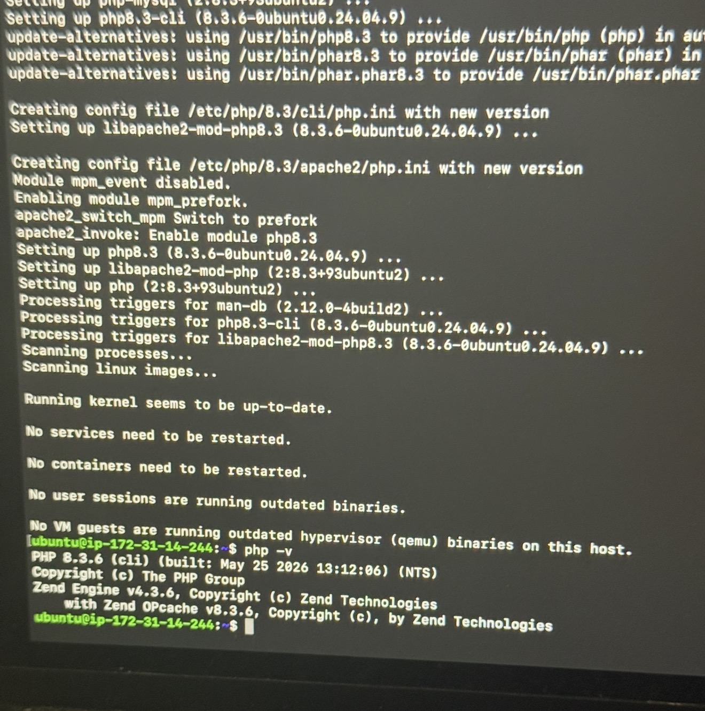
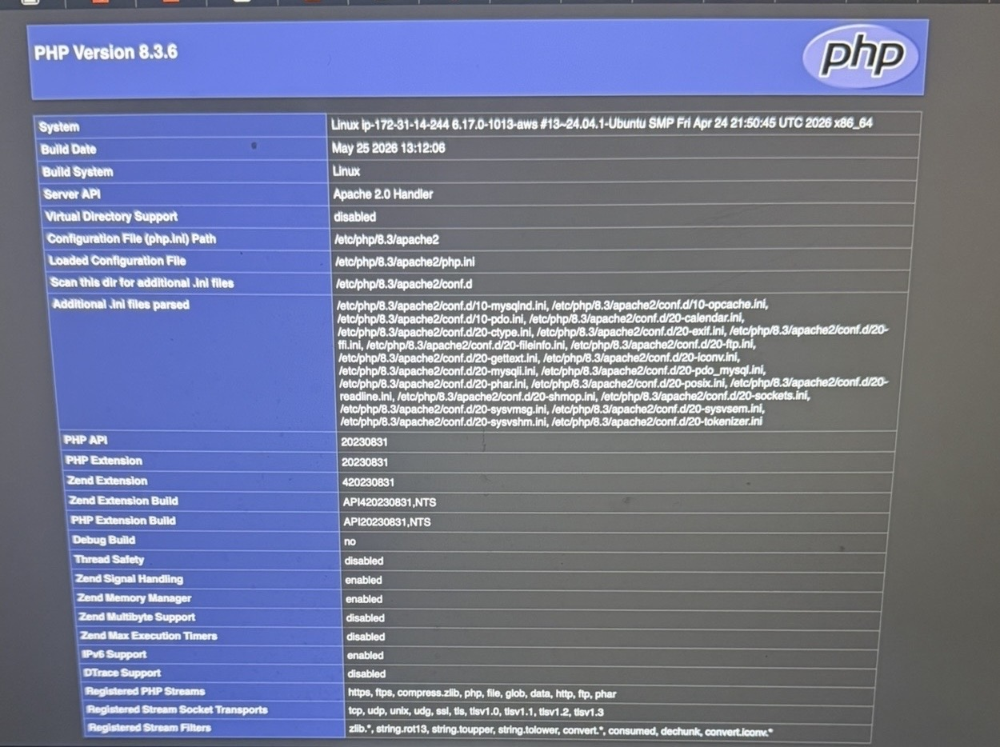
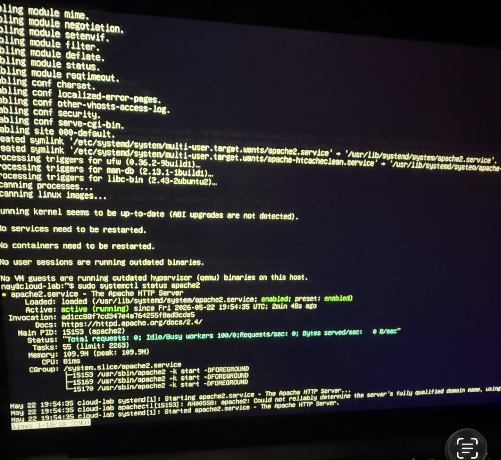
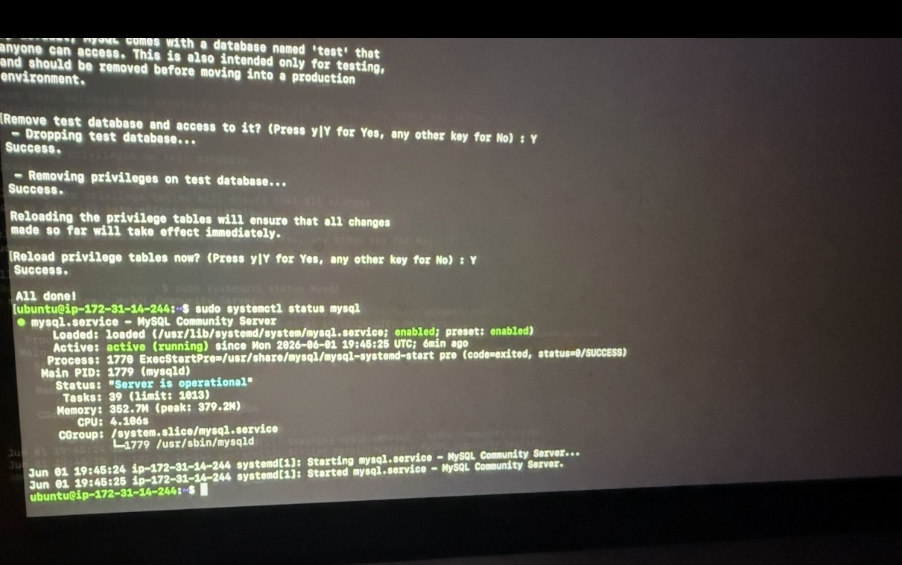
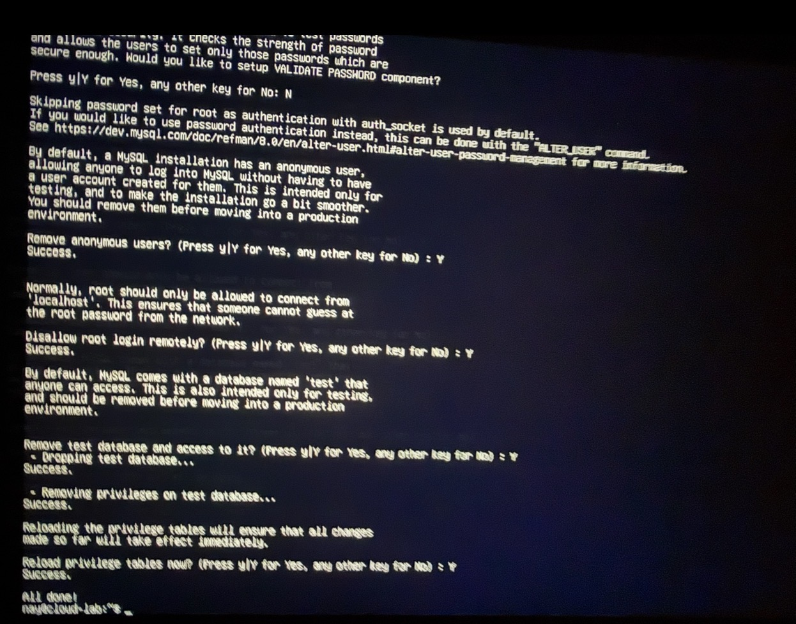

# aws-onprem-to-cloud-migration

Migrated a LAMP stack web application from an on-premises Ubuntu server to AWS EC2.

## Project Overview

A small business was running a web application on a local on-premises Ubuntu server. The goal of this project was to migrate that infrastructure to AWS EC2, improving reliability, security and scalability while reducing long-term operational costs.

## Architecture

### On Premises
MacBook running UTM → Ubuntu Server VM → Apache → MySQL → PHP

### AWS Cloud
Internet → Security Group → EC2 Instance (Ubuntu) → Apache → MySQL → PHP

## Architecture Diagram

## Validation Screenshots

### Migrated Web Application

### PHP Version Verification

### PHP Information Page

### Apache Service Status

### MySQL Service Status

### MySQL Secure Installation

## Technologies Used

- Ubuntu Server
- Apache HTTP Server
- MySQL
- PHP 8.3
- AWS EC2
- AWS Security Groups
- SSH Key Pair Authentication
- UTM Virtualisation

## Migration Process

1. Built local on-premises environment using UTM virtualisation
2. Installed and configured full LAMP stack locally
3. Launched AWS EC2 instance with Ubuntu
4. Configured security groups restricting SSH and allowing HTTP access
5. Connected to EC2 using SSH key pair authentication
6. Deployed identical LAMP stack on cloud server
7. Verified web application accessible via public IP

## Challenges and Solutions

- Downloaded incorrect Ubuntu architecture for Apple Silicon and replaced it with ARM64 version
- Resolved SSH key permission issues using chmod 400
- Fixed browser connectivity issues by validating public IP access
- Applied pending security updates after first login

## Security Measures

- SSH key authentication used instead of passwords
- Security Groups configured to restrict inbound access
- MySQL secure installation performed
- Anonymous accounts removed

## Future Improvements

- Configure HTTPS using SSL/TLS
- Add CloudWatch monitoring
- Implement automated backups
- Configure IAM roles following least privilege principles
